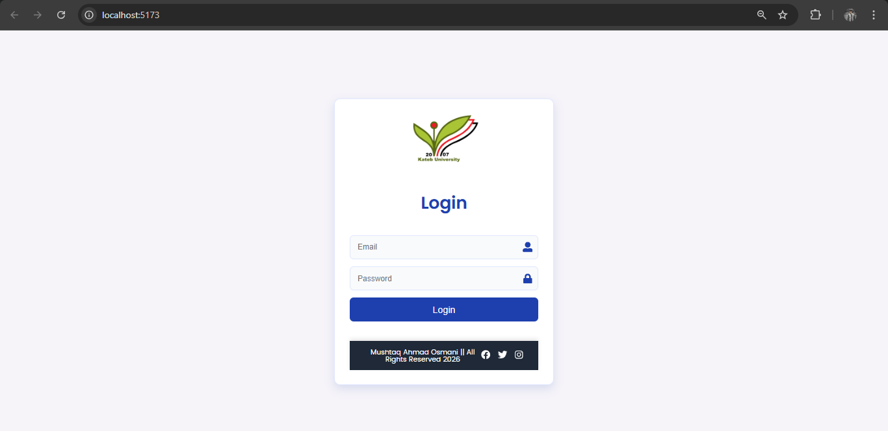
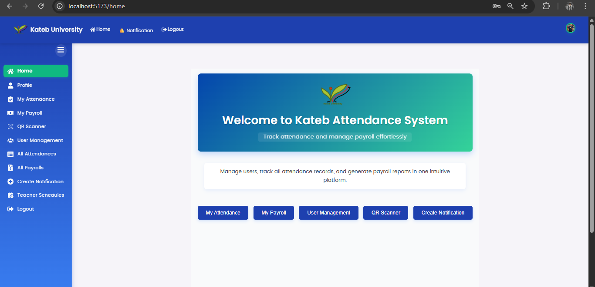
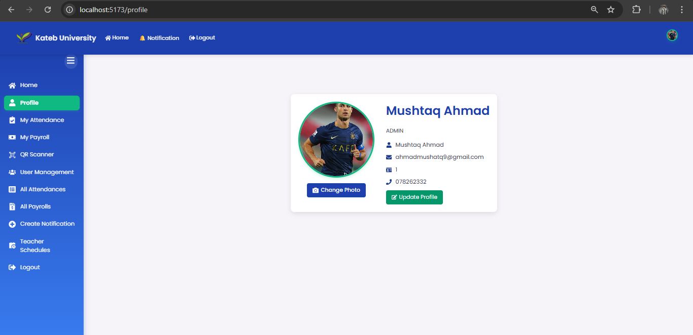
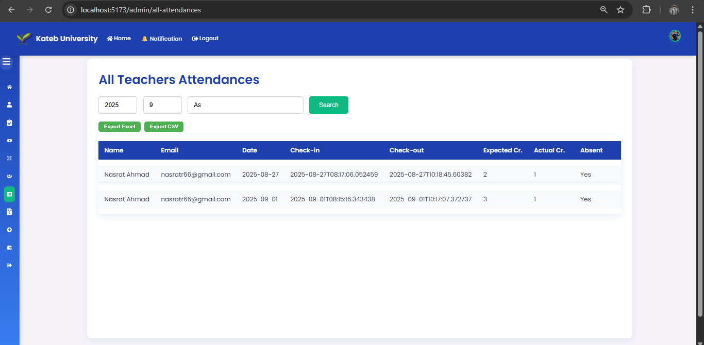
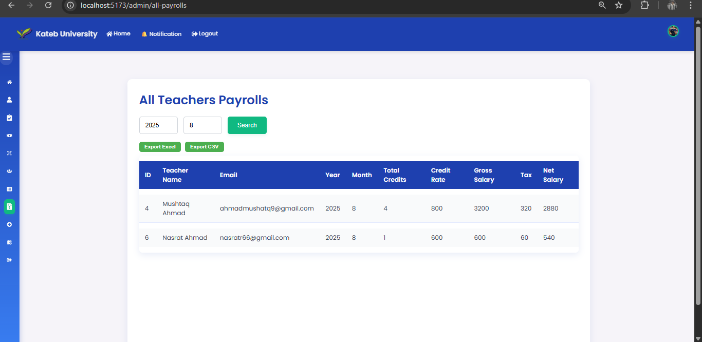
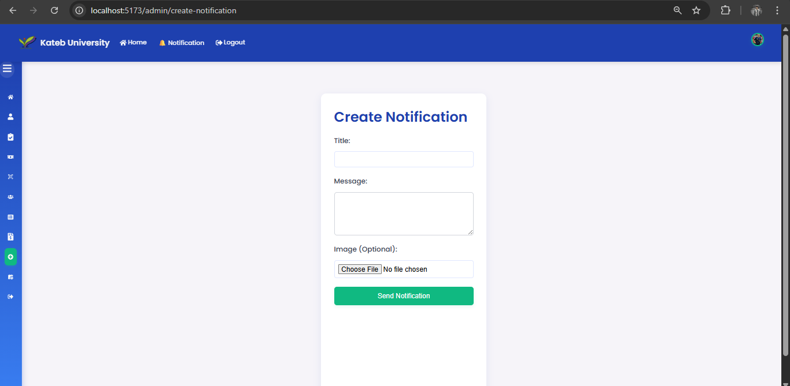
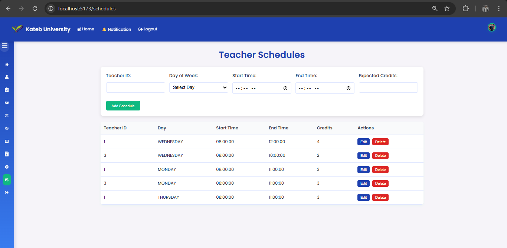

# Electronic Attendance & Payroll System using QR code – Frontend

## Project Description

This frontend application is the client-side of the **Electronic Attendance and Payroll Management System**. It provides an interactive and user-friendly interface for admins and teachers to manage attendance, payroll, schedules, and notifications.

The frontend communicates with the backend via **REST APIs** and handles authentication using **JWT tokens**.

---

## Project Goals

* Provide a clean and responsive user interface
* Enable teachers to view attendance and payroll information
* Allow admins to manage users, schedules, payroll, and notifications
* Secure communication with backend APIs

---

## User Roles

### Admin

* Login using secure authentication
* Manage users (teachers)
* View attendance records of all teachers
* View and manage payroll for all teachers
* Create and manage notifications
* Export reports (CSV / Excel)

### Teacher

* Login securely
* View personal attendance history
* View personal payroll details
* Receive notifications

---

## Core Features:

* JWT-based authentication
* Role-based UI rendering (Admin / Teacher)
* Attendance visualization
* Payroll management pages
* Notification display system
* Export attendance and payroll data
* Responsive UI design

---

## Tech Stack

* React.js
* JavaScript (ES6+)
* Axios (API communication)
* React Router DOM
* HTML5 / CSS3

---

## Application Structure (Overview)

```
src/
 ├── components/
 ├── pages/
 │    ├── LoginPage
 │    ├── HomePage
 │    ├── MyAttendancePage
 │    ├── MyPayrollPage
 │    ├── AllAttendancePage
 │    ├── AllPayrollsPage
 │    └── NotificationsPage
 ├── services/
 │    └── UserService.js
 ├── utils/
 └── App.js
```

---

## Backend Integration

This frontend application consumes REST APIs provided by the backend service.

* Authentication via JWT
* Secure API calls using Axios
* Role-based access using backend authorization

**Backend Repository:**
https://github.com/Mushtaq-Ahmad-Osmani/Electronic-Attendance-Payroll-System-using-QR-codes-Backend

---

## Screenshots

some screenshots of the UI pages 


```md









```

---

## Installation & Running Frontend:

### 1️⃣ Clone the repository

```bash
git clone https://github.com/Mushtaq-Ahmad-Osmani/Electronic-Attendance-and-payroll-System-using-QR-code-Frontend
```

### 2️⃣ Install dependencies

```bash
npm install
```

### 3️⃣ Run the application

```bash
npm start
```

The application will run on:

```
http://localhost:3000
```

---

## Authentication Flow:

1. User logs in
2. Backend returns JWT token
3. Token is stored securely
4. Token is attached to every API request
5. UI renders based on user role

---

## Future Enhancements:

* UI performance optimization
* Mobile responsiveness improvements
* Dashboard analytics
  
---

## Author:

**Mushtaq Ahmad Osmani**
Computer Science Graduate
